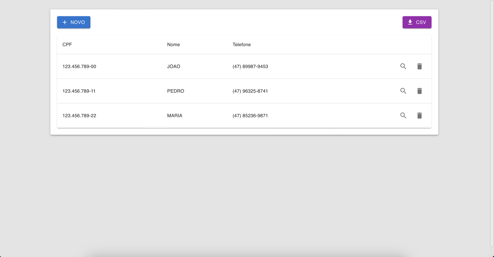
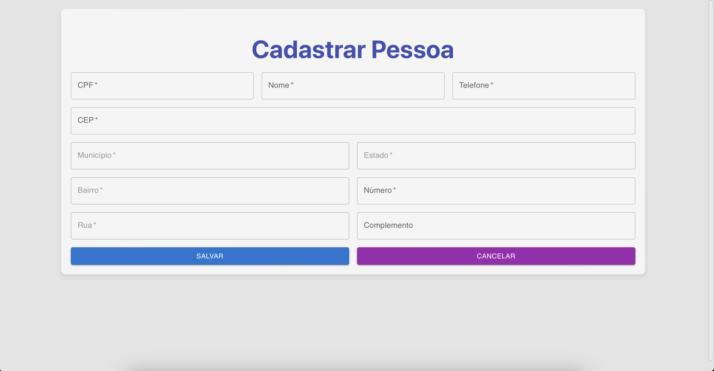
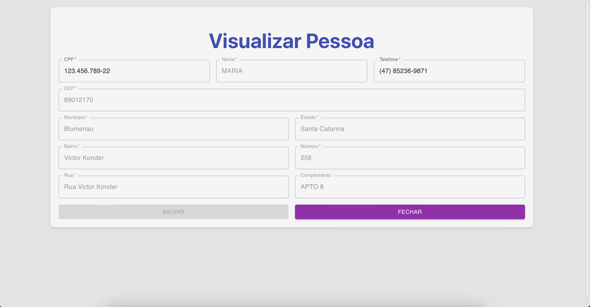
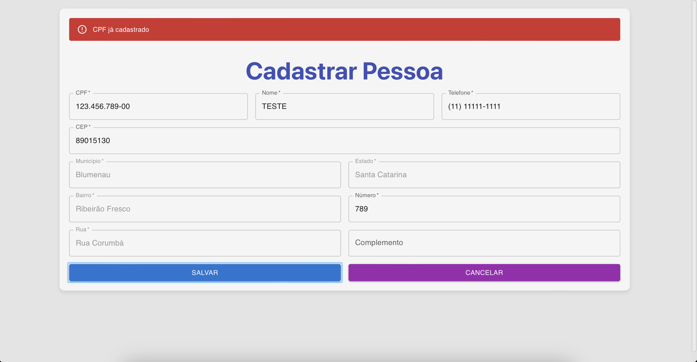
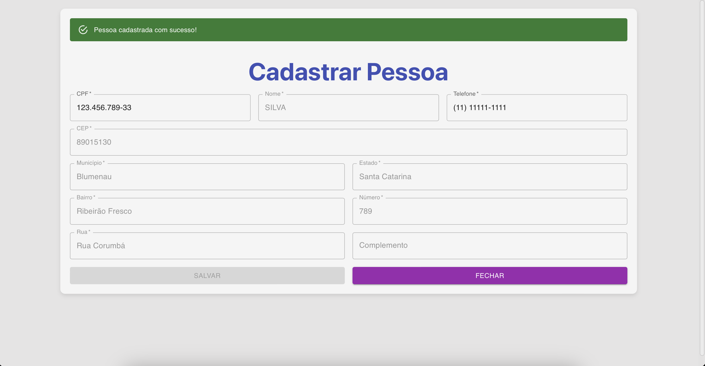
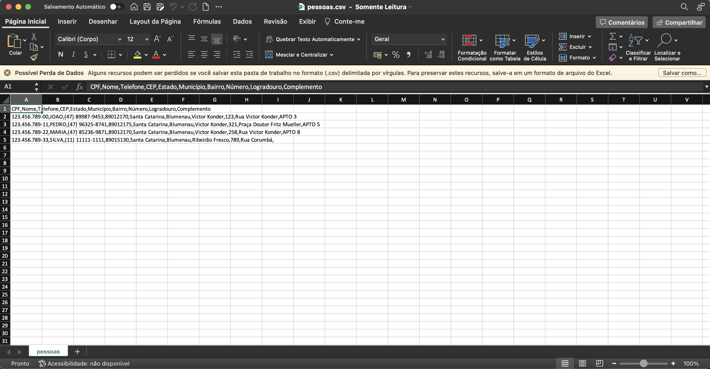

# Cadastro de Pessoa Física

## Opção 1 - Rodar usando docker

`docker-compose up`
 

Docker frontend image: [DockerHub](https://hub.docker.com/layers/grcreutzberg/cadastro-pessoa-fisica-frontend/latest/images/sha256:373473ee2ec6748578797f429267c224f28d8106020c130602e3a3f8a638851a?uuid=369098a3-33d9-42f0-b2b1-d07d59915844%0A)
 

Docker backend image: [DockerHub](https://hub.docker.com/layers/grcreutzberg/cadastro-pessoa-fisica-backend/latest/images/sha256:e4cc12b3b8ca919d92514173d53582d96c19d42b0015c4a40511e4e27e25b5b2?uuid=369098a3-33d9-42f0-b2b1-d07d59915844%0A)
 

Frontend: [http://localhost:3000](http://localhost:3000) 
Backend: [http://localhost:8080/](http://localhost:8080/) 

## Opção 2 - Rodar backend usando Docker e frontend localmente

`docker-compose up` 

`cd frontend` 

`npm install` 

`npm run dev` 

Frontend: [http://localhost:3000](http://localhost:3000) 
Backend: [http://localhost:8080/](http://localhost:8080/) 

## Opção 3 - Alternativa caso algum problema ocorra

Abra o backend na IDE 
Execute `gradle build` 
Execute `gradle bootJar` 

Para subir o Jar buildado e banco no docker: 
`docker-compose up` 

Execute frontend localmente: 
`cd frontend` 
`npm install` 
`npm run dev` 

Frontend: [http://localhost:3000](http://localhost:3000) 
Backend: [http://localhost:8080/](http://localhost:8080/) 

# Projeto

 
 
 
 
 
 
